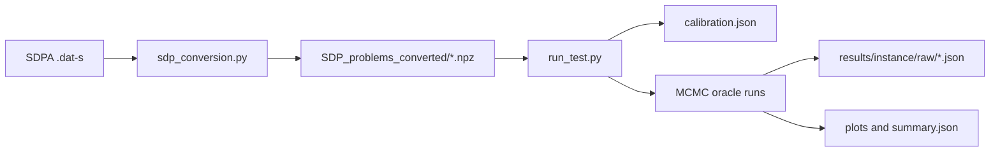

# Quantum SDP primal oracle — classical simulation

Classical simulation of the van Apeldoorn–Gilyén primal oracle for semidefinite programs, with Gibbs-state preparation via the GCDK discrete-time quantum Metropolis channel (Gilyén et al., arXiv:2405.20322). Used for the bachelor’s thesis benchmark on small SDPLIB instances.

## Pipeline overview



| Step | Script | Role |
|------|--------|------|
| 1. Convert | `sdp_conversion.py` | Parse SDPA sparse format → oracle form (`C`, `A`, `b`, `R`); write compressed `.npz` per instance. |
| 2. Calibrate | `run_test.py` | Bisect objective threshold `g` (exact Gibbs) so θ-feasibility takes ~`--target-iters` oracle steps. |
| 3. Benchmark | `run_test.py` | MCMC Gibbs oracle runs: main ε/(2R), fixed θ, random-violation replicates; parallel workers. |
| 4. Plot | `run_test.py` | Gibbs-step traces, timing pie charts, early-termination curves, per-class bar charts. |

### Core modules (imported by the driver)

| Module | Role |
|--------|------|
| `primal_oracle_quantum_v1cube.py` | Primal-oracle loop (arXiv:1804.05058 §2.2): exact or MCMC Gibbs preparation, constraint updates. |
| `gibbs_sampler_quantum_v2cube.py` | Dense simulator of the quantum Metropolis channel; `run_until_converged` for step counting. |

Jump operators for the channel are the **objective matrix `C` plus the positive constraint blocks `+F_i`** (identity and redundant `-F_i` terms are dropped). See `jump_matrices_from_arrays` in `run_test.py`.

## Requirements

- Python 3.10+
- `numpy`, `scipy`, `matplotlib`, `tqdm`
- `cvxpy` (only for `sdp_conversion.py`, to certify trace bound `R` from the dual optimum)

Install:

```bash
pip install numpy scipy matplotlib tqdm cvxpy
```

## Directory layout

```
Gibbs sampler code Optimized/
├── sdp_conversion.py              # SDPA → .npz converter
├── primal_oracle_quantum_v1cube.py
├── gibbs_sampler_quantum_v2cube.py
├── run_test.py                    # benchmark driver
├── SDP_problems/                  # source .dat-s files (+ Meta/format.txt)
├── SDP_problems_converted/        # converted .npz + manifest.json
├── results/                       # default benchmark output (ε = 0.1)
└── PARAMETERS.md                  # parameter choices (R, ε, θ, g, β)
```

## Quick start

**1. Convert instances** (from the repo root of this folder):

```bash
python sdp_conversion.py --output-dir SDP_problems_converted
```

Convert a subset:

```bash
python sdp_conversion.py --instances hinf1 truss1 --output-dir SDP_problems_converted
```

**2. Run the thesis benchmark** (8 instances by default, warm start, ε = 0.1):

```bash
python run_test.py --results-dir results --workers 32
```

Pilot on one instance:

```bash
python run_test.py --instances hinf1 --random-runs 2 --workers 4
```

Resume without recomputing cached runs:

```bash
python run_test.py --results-dir results --skip-existing
```

### Main CLI options (`run_test.py`)

| Flag | Default | Meaning |
|------|---------|---------|
| `--epsilon` | `0.1` | SDP precision ε; Gibbs target θ = ε/(2R) for relative runs. |
| `--fixed-theta` | `0.01` | Fixed trace-distance target for alternate Gibbs criterion. |
| `--target-iters` | `500` | g-calibration budget (exact Gibbs). |
| `--max-oracle-iters` | `550` | Hard cap on oracle iterations per MCMC run. |
| `--gibbs-max-steps` | `2000` | Cap on channel applications per Gibbs preparation. |
| `--random-runs` | `5` | Random-violation replicates per Gibbs criterion. |
| `--cutoffs` | `50 100 200` | Early-termination step counts (main ε/(2R) run only). |
| `--gibbs-warm-start` / `--no-gibbs-warm-start` | on | Continue each Gibbs chain from the previous oracle iterate. |
| `--workers` | `32` | Parallel processes (BLAS pinned to 1 thread each; capped at 64). |

## Benchmark protocol (default)

For each converted instance:

1. **g-calibration** — bisection on `g` using exact Gibbs (stored in `calibration.json`).
2. **Main ε/(2R)** — max-violation selection, warm start, early-termination cutoffs logged.
3. **Main fixed θ** — same oracle, Gibbs target θ = `--fixed-theta`.
4. **Random × N** — random violated constraint, both Gibbs criteria.

Default instances: `hinf1`, `hinf4`, `hinf12`, `control1`, `control2`, `truss1`, `truss3`, `truss4`.

## Output structure

```
<results_dir>/
├── calibration.json
├── _classes/
│   └── <class>_grouped_bar.png
└── <instance>/
    ├── summary.json
    ├── gibbs_steps_1e-01.png
    ├── gibbs_steps_fixed_theta_1e-02.png
    ├── gibbs_steps_comparison.png
    ├── time_breakdown_pie.png
    ├── early_termination_tracedist.png   # when cutoffs recorded
    └── raw/
        ├── eps_1e-01.json
        ├── fixed_theta_1e-02.json
        ├── random_00.json
        └── random_00_theta.json
```

Each `raw/*.json` records oracle iterations, feasibility, Gibbs steps per iteration, timing buckets, and optional cutoff trace distances.

## References

- Primal oracle: van Apeldoorn & Gilyén, *Quantum SDP solvers*, arXiv:1804.05058.
- Gibbs channel: Gilyén, Chen, Doriguello, Kastoryano, *Quantum generalizations of Glauber and Metropolis dynamics*, arXiv:2405.20322.
- SDPLIB instances: https://www.lib.uwo.ca/business/ibm_research/html/ss.html
